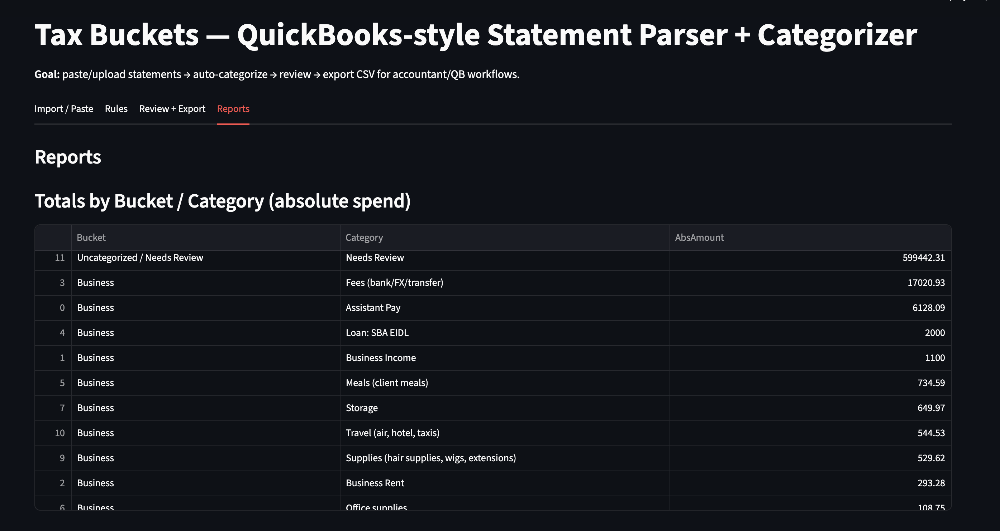

# Tax Buckets — Statement Parser + Categorizer (Streamlit)

Upload or paste bank/credit-card statements → auto-categorize with rules → review/edit → export CSV/XLSX for accountant / QuickBooks workflows.

**Live demo:** https://mrponyrivers-tax-buckets-app.streamlit.app/

---

## What this app does
This Streamlit app helps turn messy statement text (or CSV/XLSX/PDF exports) into a clean, reviewable transaction table:
- Extracts transactions (best-effort parsing for Chase statement text / PDFs)
- Auto-labels **Bucket / Category / Subcategory** using editable rules
- Supports review/editing with manual overrides
- Exports files ready for accountant workflows and QuickBooks bank feeds

---

## Try it quickly (sample statement)
1) Open the live demo
2) Go to **Import / Paste**
3) Open `sample_data/sample_statement.txt` in GitHub and copy its contents
4) Paste into the text box
5) Click **Parse pasted statement**
6) Go to **Review + Export** and test edits + downloads

Tip: Try adding a new rule in the **Rules** tab (ex: keyword “uber”) and re-apply rules to see categorization update.

---

## Features
- Paste Chase statement text OR upload CSV/XLSX/PDF
- Rule-based auto-categorization (editable rules table)
- Review/edit buckets/categories + notes
- Manual override field for categories
- Exports:
  - Full categorized export (CSV/XLSX)
  - QuickBooks-style bank feed export (CSV/XLSX)
- Reports: spend by category, top merchants, FX fees, assistant pay totals

---

## Screenshots


---

## Run locally
```bash
pip install -r requirements.txt
streamlit run app.py
